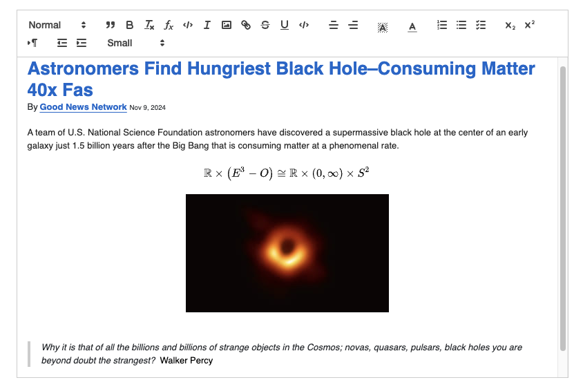

# An R interface to QuillJS <a href=""></a>

<!-- badges: start -->

[](https://github.com/svalvaro/quill/actions/workflows/R-CMD-check.yaml)
<!-- badges: end -->

[Quill](https://quilljs.com/) is an open-source JavaScript library to generate rich text editors. This R package makes it easy to create Quill editors from R.

```r
library(quill)
quill() 
```


## Installation

You can install the development version of quill from [GitHub](https://github.com/) with:

``` r
# install.packages("pak")
pak::pak("svalvaro/quill")
```

## Example

Checkout the example shiny app at [inst/examples/shiny/app.R](https://github.com/svalvaro/quill/blob/main/inst/examples/shiny/app.R).

``` r
## basic example of functioning in Shiny
library(quill)

ui <- fluidPage(
  ... 
  quillOutput("text_editor")
  ...
)

server <- function(input, output, ...) {
  ...
  output$text_editor <- renderQuill({
    quill(toolbar = toolbar_options(code = TRUE)) 
  })

  # You can listen what the user is writing in HTML, JSON, and plain text
  observeEvent(input$text_editor_content, {
    get_editor_content(input$text_editor_content, format = "HTML")
  }
  ...
}
```
